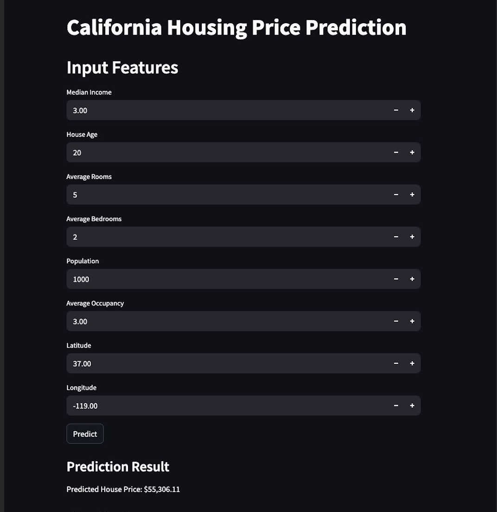

# AWS MLOps with Glue and SageMaker

## Overview

This project implements an end-to-end MLOps pipeline on AWS for the California Housing dataset, focusing on linear regression prediction. The architecture leverages AWS Glue for ETL preprocessing, Lambda and EventBridge for orchestration, SageMaker for model training and deployment, and a Streamlit frontend for user interaction.

---

## Project Structure

Project structure:

- **[data-preprocessing/](data-preprocessing/)**  
   Contains AWS Glue ETL scripts for data preprocessing.
  - **[pre_processing.py](data-preprocessing/pre_processing.py)**: Main ETL preprocessing script for the California Housing dataset.

- **[frontend/](frontend/)**  
   Streamlit-based frontend application for user interaction.
  - **[app.py](frontend/src/app.py)**: Main Streamlit app file.
  - **[requirements.txt](frontend/src/requirements.txt)**: Python dependencies for the frontend.

- **[fe-helm/](fe-helm/)**  
   Contains Helm charts for deploying frontend and related services on Kubernetes.

- **[iac/](iac/)**  
   Infrastructure as Code (IaC) using Terraform to provision AWS resources.

- **[pipeline/](pipeline/)**  
   Source code for the SageMaker MLOps pipeline.
  - **[training_preprocessing.py](pipeline/training_preprocessing.py)**: Data preprocessing script used during model training.

- **[resources/](resources/)**  
   Images and other resources for documentation.

- **[docs/](docs/)**  
   Project documentation and reports.
  - **[umbertodomenico_ciccia_summary.pdf](docs/umbertodomenico_ciccia_summary.pdf)**: Project report (in Italian).
  - **[ciccia-assignement.pdf](docs/ciccia-assignement.pdf)**: Project assignement (in Italian).

## Architecture

1. **ETL Pipeline with AWS Glue**
   - Raw data is uploaded to an S3 buckets.
   - When new data is uploaded to the S3 bucket, an EventBridge rule triggers a Lambda function. The Lambda function starts the Glue Crawler to update the data catalog.  - An [AWS Glue Crawler](iac/modules/terraform-aws-glue/README.md) detects new uploads in the S3 data bucket and updates the data catalog.
   - After the crawler completes successfully, an ETL job is started to preprocess the California Housing dataset (see [pre_processing.py](data-preprocessing/pre_processing.py)).
   - Cleaned data is written to a final preprocessed S3 bucket.

2. **Triggering SageMaker MLOps Pipeline**
   - Upload of the preprocessed file to the S3 bucket triggers another EventBridge rule.
   - This rule starts the [SageMaker MLOps pipeline](iac/modules/terraform-aws-sagemaker/README.md), which:
     - Runs further data processing ([training_preprocessing.py](pipeline/training_preprocessing.py))
     - Trains a linear regression model using XGBoost
     - Registers and deploys the model as an endpoint

3. **Model Serving API**
   - After training, the model is deployed as a SageMaker endpoint.
   - An API is exposed for making predictions using this endpoint.

4. **Frontend**
   - The [frontend](frontend/README.md) is built with Streamlit, allowing users to interact visually with the model and make predictions.

---

## Getting Started

1. **Infrastructure Deployment**
   - All AWS resources are provisioned using Terraform modules in the `iac/` directory.
   - Configure your AWS credentials and run `terraform init && terraform apply` in the `iac/` folder.

2. **Data Upload**
   - Upload raw California Housing data to the designated S3 data bucket.
   - This triggers the ETL pipeline automatically.

3. **Model Training and Deployment**
   - Once preprocessing is complete, the pipeline triggers SageMaker for training and deployment.
   - The trained model is registered and deployed as an endpoint.

4. **API and Frontend**
   - Use the provided API to make predictions.
   - Launch the Streamlit frontend for visual interaction.

---

## References

- [AWS Glue Documentation](https://docs.aws.amazon.com/glue/)
- [AWS SageMaker Documentation](https://docs.aws.amazon.com/sagemaker/)
- [Relazione](docs/umbertodomenico_ciccia_summary.pdf)

---
